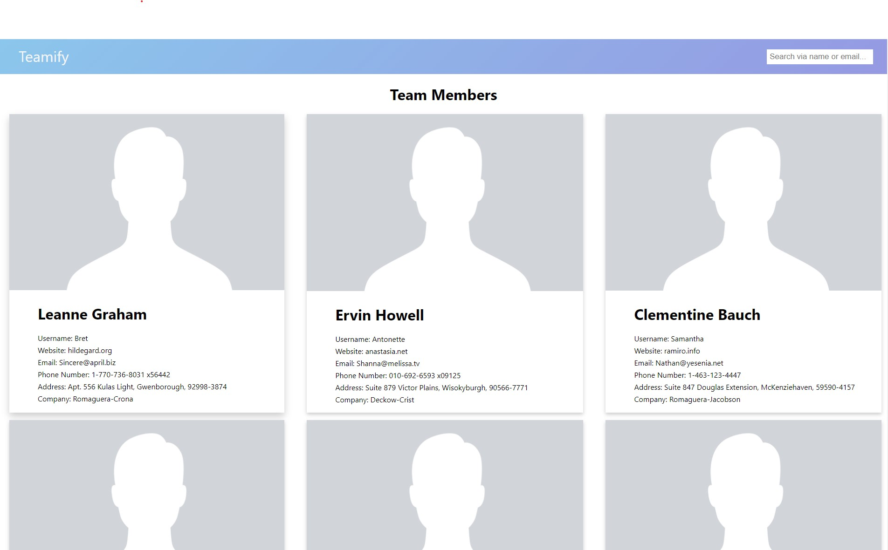

# Teamify

A web application that shows a list of current Team users using React.




## Description

Welcome to teamify repository. This responsive web application is a project that uses axios for fetching api from https://jsonplaceholder.typicode.com and using pure CSS3 & HTML5 for design.

## Getting Started

### Dependencies

- Prerequisites needed before installing program.
  - Node.js
  - Git version control
  - Source code editor
  - Windows, Mac or Linux OS

### Installing

- To set up this project.

1. clone repo

```
git clone https://github.com/emmanuelbitang/teamify.git
```

2. cd into directory

```
cd teamify
```

3. install dependencies using npm or yarn

```
yarn OR npm i
```

### Executing program

- To run the program.

```
yarn run start OR npm start
```

## Authors

Emmanuel Bitang  
[@emnl_mrno](https://www.instagram.com/emnl_mrno/)

## Version History

- 0.1
  - Initial Release

## License

This project is licensed under the MIT License - see the LICENSE.md file for details

## Acknowledgments

- [create-react-app](https://create-react-app.dev/)
- [React](https://reactjs.org/)
- [@testing-library/react](https://testing-library.com/)
- [Node.js](https://nodejs.org/en/)
- [axios](https://axios-http.com/)
- [ESLint](https://eslint.org/)
- [Git](https://git-scm.com/)
